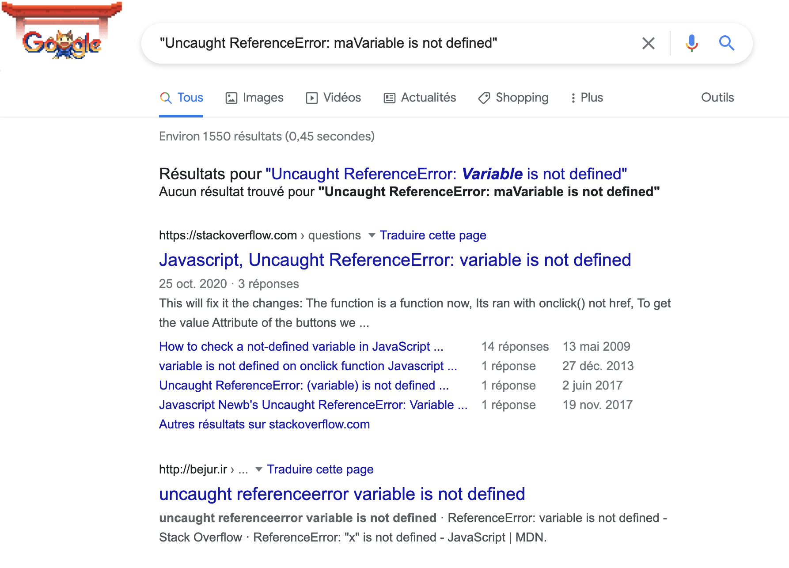

# Comment faire une recherche efficace sur Google

L'idée n'est pas ici de lister toutes les fonctionnalités de la recherche Google et les différents paramétrages possibles, mais de vous donner quelques astuces qui se sont avérées très utiles dans les milliers de recherches (au moins) que j'ai eu à faire depuis que je suis développeuse. 👩‍💻

## 1- Faites vos recherches en anglais

Les anglicismes à chaque phrase, c'est lassant. J'en ai conscience, croyez-moi. Pourtant, dans le développement, l'anglais est incontournable. Votre code est en grande partie écrit en anglais, les autres développeurs parlent en anglais et... La documentation des outils que vous utiliserez sera quasimment tout le temps écrite en anglais. Alors si vous avez besoin de ressources sur un problème, autant chercher directement là où il y a le plus de ressources. D'autant plus que quand il s'agit d'une question de code, vous trouverez très souvent des réponses sur le site [StackOverflow](https://stackoverflow.com/). Alors autant vous y mettre dès maintenant. 🇬🇧

## 2- Utilisez les guillemets

Peut-être que vous connaissez déjà cette astuce. Personnellement, je l'ai apprise en atelier informatique au CDI du lycée (oui... ça date), mais c'est super utile : vous pouvez préciser une suite de mots exacte que vous voulez voir figurer dans les résultats. C'est aussi très utile pour forcer l'orthographe d'un mot, notamment quand Google suggère une correction qui ne correspond pas à ce que vous cherchez. Par exemple, pour un message d'erreur qui est retourné dans votre code, si vous pensez qu'il s'agit d'une erreur spécifique, vous pouvez tout à faire utiliser les guillemets.

## 3- Remplacez un mot par *

D'ailleurs, si vous avez une expression complète, mais qu'il vous manque un mot, vous pouvez tout-à-fait le remplacer par un astérisque. Vous pouvez même utiliser plusieurs fois "*" dans votre phrase pour remplacer chaque mot manquant.

Pour l'exemple précédent, vous auriez pu faire "Uncaught ReferenceError: * is not defined", ce qui vous aurait permis d'être moins spécifique en retirant le nom de votre variable.

## 4- Formulez votre recherche

Le choix des mots est important. Pour formuler une recherche Google qui fonctionne bien, plusieurs astuces sont à mettre en application :

### Ne mettez que les mots importants

Par exemple, si vous cherchez quel langage utiliser por coder un site internet, au lieu de taper "what language should I use to code a website", vous pouvez tout simplement écrire "choose coding language website".

### Ajoutez progressivement des termes

D'ailleurs, il est souvent recommandé de commencer une recherche avec des termes très simples, et de voir ensuite ce que vous obtenez en ajoutant d'autres mots. Par exemple, pour l'exemple précédent, vous auirez pu commencer par :
- "coding language"
- puis "coding language website"
- et enfin "choose coding language website".

### Choisissez vos mots

Lorsque vous faites votre recherche, il est primordial d'utiliser les bons mots. Si vous avez une question sur un sujet technique mais que vous utilisez un mot approximatif (qui n'est pas adapté), votre recherche sera probablement infructueuse. 

### Changez les termes

Si les résultats de votre recherche ne sont pas satisfaisants (ça arrive assez souvent en code), vous pouvez toujours remplacer certains mots par d'autres. Bous devez garder à l'esprit que l'appellation que vous utilisez n'est pas forcément celle que d'autres utilisent. 

## 5- Formulaire de recherche avancée

Et enfin, il vous est toujours possible d'affiner encore davantage votre recherche en utilisant le formulaire de recherche avancé. D'ailleurs, si vous voulez un meilleur aperçu des différentes fonctionnalités qu'il offre, je vous conseille... de chercher des articles sur Google. 😁