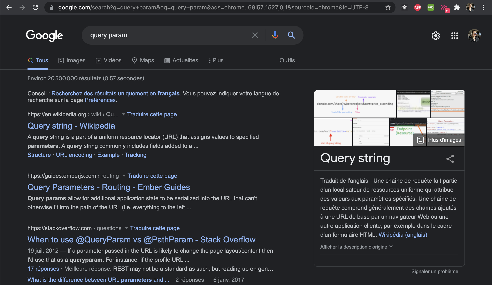
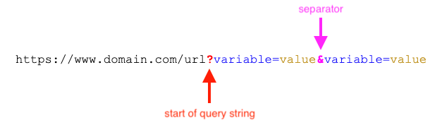

# Plongez dans le monde des données

Jusqu'à maintenant, nous avons créé nos premières interactions avec les utilisateurs en utilisant JavaScript pour manipuler le DOM. Yay ! 🎉

Mais JavaScript ne sert pas uniquement à créer des interactions avec le DOM : JavaScript nous permet également de manipuler des datas. 

## Pourquoi manipuler des datas ?

Imaginons que vous voulez créer un site qui permet d'écrire des commentaires, comme un forum (vous pouvez y penser comme un petit clone de Twitter). Comment faire ? Vous vous en doutez sûrement : en manipulant les datas ! Et vous allez utiliser JavaScript pour cela.

Dans notre cas, voilà une petite liste des éléments préexistants' :
1- On a une interface qui permet d'entrer du texte et d'afficher les éléments sauvegardés
2- On dispose également d'un backend qui permet de stocker des données dans une base de données

Les étapes à suivre pour gérer les datas avec les interactions de l'utilisateur sont les suivantes :

- Quand notre interface se charge, elle interroge le backend pour récupérer les commentaires stockés précédemment
- Quand un utilisateur entre le texte et appuie sur "enregistrer", son contenu est envoyé au backend qui le sauvegarde dans la base de données

## Comment stocker les datas : les bases de données

> Mais au fait, c'est quoi une base de données ?

La base de données (BDD) est un système qui va permettre d'enregistrer des informations. Mais n'imaginez pas la base de données comme une sorte de fichier texte où tout est sauvegardé en vrac : les informations stockées dans une base de données sont toujours organisées, nous permettant alors de retrouver simplement notre information. 

Vous vous souvenez de la comparaison avec l'armoire et les tiroirs pour les variables ? Et bien, vous pouvez reprendre la même image pour la base de données, sauf qu'ici, vos données vont être directement sauvegardées dans les serveurs, vous permettant d'accéder à vos données autant que nécessaire.

Pour notre exemple de clone de Twitter, si on veut sauvegarder un commentaire, voilà les données que l'on pourrait sauvegarder :
- auteur : mail de la personne à l'origine du commentaire
- date : date du commentaire
- contenu : contenu texte du commentaire
- images : images externes ajoutées au commentaire (par exemple)

Et si on voulait afficher d'avantage d'information, à partir du mail de l'auteur du commentaire, on irait chercher dans le tiroir "compte", et on récupérerait :
- la photo de profil du compte
- le prénom / nom du compte de l'auteur
- le lien vers la page profil de l'auteur
- etc.


## Les datas, c'est quoi

Concrètement aujourd'hui, qu'est-ce qui est stocké dans des bases de données ?

Sans vouloir paraître dramatique, absolument tout. Lors de la séance sur les objets, je vous avais montré les fichiers que j'avais pu récupérer depuis Facebook sur toutes les datas qu'ils avaient à mon sujet : les pages likées, les commentaires, les likes, les images, les messages, les pokes, etc. Pour récupérer toutes ces données, c'est comme si Facebook avait fait une requête à sa base de données pour récupérer toutes les données où user === 'alexia toulmet' (pour simplifier).

Mais tous les sites ont leur propres données stockées. Par exemple, quand il y a des inscriptions pédagogiques à Sciences Po, Sciences Po a créé les différents cours dans les bases de données avec une ID pour chaque cours, et quand les étudiant·e·s s'inscrivent, iels ajoutent leur nom dans la liste des inscrit·e·s.

## Qui gère les datas ? 

> Pourquoi on a besoin d'un backend pour utiliser une BDD ?

Comme vous aviez pu le voir dans les séances précédentes, le backend est en quelque sorte la partie émergée de l'iceberg qu'est le web. Quand vous allez sur un site internet depuis votre navigateur, votre navigateur récupère le fichier HTML, le CSS et le JS : tous ces fichiers sont publics. 

Mais pour récupérer ou modifier des données depuis une BDD, il faut que vous y soyez autorisé. 

> Par exemple, si vous voulez modifier votre photo de profil, le backend doit vérifier que vous êtes bien connecté avec votre compte. Ainsi, vous ne pourrez pas modifier la photo de profil d'un autre compte utilisateur. 
 
Pour faire la vérification de qui a le droit, l'authentification, etc. on doit le faire depuis le backend (parce que les opérations ne peuvent pas se faire directement dans le navigateur de l'utilisateur, sinon n'importe qui pourrait fausser la data).

## Découvrez comment le backend et le frontend communiquent entre eux

Comme toujours en informatique, il existe des protocoles. Le protocole le plus courant permettant de communiquer entre le frontend et le backend s'appelle HTTP. Les messages envoyés par le client, généralement un navigateur web, sont appelés des requêtes et les messages renvoyés par le serveur sont appelés réponses.

On va avoir des types de requêtes différentes pour récupérer des données (GET) et d'autres types de requêtes pour modifier la donnée.

Nous allons les mettre en pratique dans quelques instants !

## Mettez en pratique ce que vous avez appris

### Découvrez le JSON

Lorsque votre frontend récupère des datas, il les récupère dans un format spécifique (vous vous doutez qu'il n'allait pas les récupérer en format texte Word `.docx`). Ce format qui est très largement utilisé dans le web s'appelle le JSON, pour `JavaScript Object Notation`.

Le JSON est un format de données qui est assez similaire avec la syntaxe des objets JavaScript, vous allez voir !


Ainsi, il vous suffit de récupérer le fichier dans votre JavaScript. D'assigner son contenu à une variable, et vous pouvez accéder à chacun des éléments de la même manière que ce que vous avez fait jusqu'à maintenant. ✨

### Faites votre première requête de JSON

Pour l'occasion, nous allons créer une nouvelle page sur votre portfolio : la page "JS Skills" qui va nous permettre d'afficher les données que vous récupérez depuis le backend. 
- On importe nos datas dans un fichier `data.json`
- On crée ensuite un nouveau fichier HTML
- On ajoute notre lien dans la barre de navigation
- Sur cette page, on copie la barre de navigation, et on vient ajouter du contenu :
- on crée un bouton qui, quand on clique dessus, appelle la fonction `getData`.
- Allons maintenant dans notre fichier `index.js`.
  
Mais pour cela, une syntaxe un peu particulière est nécessaire : ici, même si votre fichier est en local, vous allez indiquer à JavaScript que vous allez chercher (requêter) des données.

On va donc avoir besoin d'utiliser les mots clés `async` et `await`. Il nous permettent d'utiliser JavaScript de manière asynchrone : ce qu'on demande ne s'exécute pas immédiatement, mais demande un temps de chargement.

On va maintenant définir `getData`.

On fait donc 
```
async function getData() {
 
}
```

et dans notre fonction, on va requêter nos datas, avec [l'outil fourni par JavaScript `fetch`](https://developer.mozilla.org/fr/docs/Web/API/Fetch_API/Using_Fetch).

On va avoir besoin de `await` pour dire qu'on attend le résultat (sinon on obtient une syntaxe très complexe dont on ne peut rien faire). On a donc 
```
async function getData() {
  let data = await fetch('./data.json')
}
```

Mais là, si vous faites un `console.log` de ce que vous avez récupéré, vous ne pouvez pas encore accéder au contenu. Vous allez avoir besoin de préciser dans votre code JavaScript que vous manipulez du JSON en faisant 👇 :
```
async function getData() {
  let data = await fetch('./data.json')
  let JSONdata = await data.json();
  console.log(JSONdata)
}
```

Yay ! La console vous affiche bien le contenu de votre JSON 🔥.

### Affichez votre contenu

Comme vu la semaine dernière, vous pouvez maintenant afficher vos éléments avec JS côté navigateur : 
- vous accédez à un élément avec `getElementById`
- vous affichez un premier élément de votre `JSON`, par exemple ici `JSONdata.intitulé`
- Puis vous allez plus loin en affichant un tableau par exemple ici les séances.
- Toujours avec votre un élément auquel vous avez accédez, vous allez, dans une boucle, créer des éléments, et utiliser `votreElement.appendChild(ELEMENTCREE)`.

Vous devriez ainsi obtenir vos éléments les uns à la suite des autres.

### Faites votre première requête

Maintenant que vous avez appris à requêter du JSON en local, vous ne devriez avoir aucune difficulté à requêter des datas depuis un backend.

Pour l'occasion, j'ai créé un backend très basique qui retourne des données sur l'url : `https://scpo-basic-backend.herokuapp.com`. 

Vous allez cette fois-ci y accéder depuis la fonction `getBackendData`.

Dans notre fonction `getBackendData`, on a donc :
```
async function getBackendData() {
  let request = await fetch('https://scpo-basic-backend.herokuapp.com')
}
```

Mais comme vous avez vu juste avant, cela ne suffit pas : il faut maintenant convertir notre requête au format `json`, qui est le format utilisé pour manipuler des données dans JavaScript. On fait donc : 

```
async function getBackendData() {
    let request = await fetch('https://scpo-basic-backend.herokuapp.com')
    let results = await request.json()
    console.log(results)
}
```

Et voilà ! 🎉

On récupère bien les données depuis notre backend !

On peut maintenant manipuler le DOM avec JavaScript pour afficher ce qui est retourné, en faisant par exemple une simple `alert`.


### Passez un paramètre à votre requête

Il existe une notation standard pour passer des paramètres dans une requêtes où on récupère des datas : on les passe directement dans l'URL. Vous les manipulez sans même vous en rendre compte quand vous partagez des liens, par exemple sur google :



Ils sont formatés de la manière suivante : 👇



Testons cela dès maintenant dans notre exercice : on passe à notre requête le paramètre salutation=bonjour. On fait donc : 
```
let request = await fetch('https://scpo-backend-2.herokuapp.com/?random=true')
```

Et nous obtenons bien une citation qui change à chaque fois qu'on appelle notre backend ! Yay ! 🎉

## Pour la semaine prochaine 

Vous devrez vous assurer que vous avez bien compris ce que nous avons fait ensembles en cours. Vous pouvez choisir de présenter la feature des citations comme vous le souhaitez.