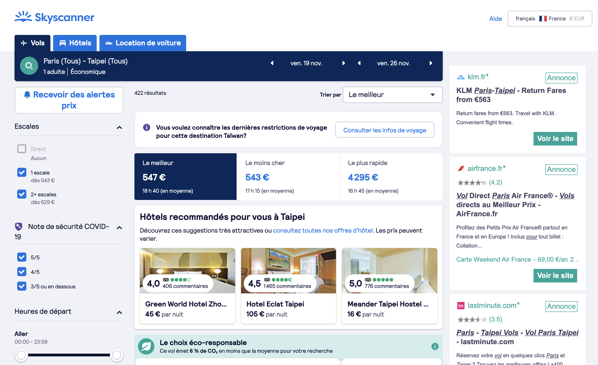

# Découvrez les APIs

Nous en avions rapidement parlé la semaine précédente : les datas sont au coeur de tout dans la tech. Mais comment y accéder ?

> Par exemple, quand vous voyez un comparateur de vols, à votre avis, où la data a-t-elle été récupérée ? 



Et bien, ici, le site Skyscanner a fait des requêtes aux différentes compagnies aériennes pour obtenir les prix sur les dates cherchées, et à partir de là, fait la comparaison en backend, et envoie le résultat au frontend. Et pour faire ces différentes recherches, il est passé par les APIs des différents sites.

## Définition d'une API

 Une API facilite l’interaction entre deux applications différentes afin qu’elles puissent communiquer entre elles : elle sert d’intermédiaire. Le client va demander à l’API une information, celle-ci va aller chercher cette information dans la base de données puis la renvoyer au client dans un second temps.


Les API agissent comme un intermédiaire qui transmet des messages à travers un système de requêtes et de réponses. 

Les API peuvent communiquer :

- d’un logiciel à un logiciel ;
- d’un client à un serveur ;
- ou d’un logiciel à des développeurs.

On peut distinguer les APIs privées des APIs publiques.

### Les APIs privées 

Les API privées garantissent que les personnes en dehors de votre entreprise ou de votre application n’ont pas accès aux données disponibles de votre base de données. Il s'agit ici de ce que j'avais appelé backend : il s'agit tout simplement d'une API qui reste interne à une entreprise ou une application, à laquelle les personnes / développeur·ses externes n'ont pas accès.


### Les APIs publiques

En revanche, les APIs publiques sont utilisables par d'autres personnes, par d'autres sites web.

Dans notre exemple, Skyscanner s'appuie sur des APIs qui sont publiques. Imaginons que vous vouliez construire un site web qui répertorie les conditions météo des stations de ski. Plutôt que de collecter vos propres données météorologiques, vous pouvez utiliser une API de météo et y trouver vos données ! 🌤 Il existe des milliers d’API publiques que les développeurs peuvent utiliser de différentes façons pour améliorer leurs projets. Si vous voulez un aperçu des APIs disponibles publiquement, je vous conseille de [consulter ce lien](https://github.com/public-apis/public-apis).

Pour vous citer quelques APIs connues, on peut citer les APIs Google (Maps, Spreadsheet, Youtube, etc.), l'API du site IMDB, Spotify, Slack, etc.

En revanche, ce n'est pas parce qu'une API est publique qu'elle est forcément gratuite. On assiste à une progressive monétisation des APIs, qui exigent un paiement selon le nombre de requêtes effectuées.

## Et l'OpenData dans tout ça

L'OpenData, ça vous dit quelque chose ? Il s'agit du mouvement qui vise à libérer la donnée, qu'il s'agisse des données des entreprises, mais surtout des données des administrations. L'accès aux données vise à permettre aux citoyens de mieux contrôler l'administration, d'autre part d'exploiter ces données. Sous l'impulsion de l'ONG Open Knowledge Foundation, les différents gouvernements se sont progressivement de plus en plus impliqués dans ces enjeux. 

En France, cela commence notamment au niveau national avec la création en 2011 de la mission Etalab, service du Premier ministre chargé de coordonner cette politique publique des données ouvertes. Ainsi qu'avec le lancement de la plateforme data.gouv la même année.

En 2016, la loi pour une République numérique pose le principe d'ouverture par défaut des données publiques et va jusqu'à créer la notion de service public de la donnée.

Un exemple récent de l'utilisation de données publiques pour créer une application, est l'utilisation qu'a été faite par Guillaume Rozier des datas pour Vite ma dose et ses statistiques sur le Covid.

## Découvrez l'authentification sur une API Google

Comme nous l'avions vu la semaine dernière, nous allons maintenant intégrer une requête dans notre page "For fun" afin de récupérer les données depuis une Spreadsheet Google. Pour cela, vous allez :

1- Chercher dans la doc comment faire (mais ici, je suis là pour vous faciliter la vie)
2- devoir créer de quoi vous authentifier sur Google : un token
3- Utiliser votre token pour faire votre requête.

`const request = await fetch('https://sheets.googleapis.com/v4/spreadsheets/{l'id de votre spreadsheet ici}/values/A1:A100?key={votre clé ici}')`

Et vous allez ensuite parcourir la data pour afficher vos éléments en utilisant le code ci-dessous : 
```
for (elem of maData) {
   let p = document.createElement("p")
   p.innerText = elem
   monElement.append(p)
 }
```

## Exploitez la puissance du low code

À partir du moment où vous pouvez récupérer vos données dans Google spreadsheet, vous pouvez connecter des APIs entre elles avec la puissance du low code. Ici, vous allez avoir une démonstration de la puissance de Zapier pour connecter les APIs entre elles sans avoir à tout connecter manuellement. 

Vous [trouverez ici quelques exemples](https://zapier.com/learn/automate-apps-examples/popular-app-automations/) d'utilisations de Zapier qui s'avèrent particulièrement utiles.