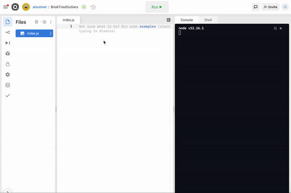

# Maniez les variables

La semaine dernière, vous avez vu les bases théoriques du développement, et vous avez pu manipuler quelques fichiers basiques de JS, avec des `console.log` et des commentaires. Mais le moment est maintenant venu de nous plonger dans la pratique. 🔥

## Appréhendez les variables

Pour l'instant, nous avons utilisé des valeurs directement dans nos console.log, qui n'étaient donc utilisées qu'une seule fois. 

Mais comment faire si vous souhaitez faire une opération complexe ? Et réutiliser le résultat ?!

Les variables sont faites pour ça !

Elles nous permettent de mémoriser simplement des valeurs, et de pouvoir les utiliser dès que nécessaire.

Concrètement, qu'est-ce que ça veut dire d'un point de vue informatique. Ça veut dire qu'on dit à notre ordinateur ordonne à notre ordinateur de prendre une partie de sa mémoire, d'y stocker le contenu que l'on souhaite, et notre variable va pointer sur cette valeur.

Chaque variable est nommée. 

On peut alors voir notre programme comme une sorte de grand meuble, dans lequel il y a des tiroirs. Les tiroirs vont permettre de stocker nos affaires (nos variables). Les tiroirs sont des sortes d'étiquettes, les noms de nos variables. Pour affecter une donnée à une variable, on utilise le signe `=` ainsi que le mot clé de variable `let`.

Nous allons ici créer la variable `maVariable`, dans laquelle on exécute l'opération "6 * 7" ce qui nous donne :
```
let maVariable = 6 * 7
```

On fait un console.log... Et on a bien le résultat ! 🎉



Essayez avec une addition, une soustraction, une multiplication et une division !

Pour vérifier que vous avez bien compris,[ on fait le premier exercice de la séance.](https://replit.com/@scpo-fall-2021/S2-variablesexercice-1#index.js)


## Découvrez les types

La semaine dernière, vous avez écrit du texte. Pour cela, vous avez utilisé les accolades `" "`. Pour utiliser un nombre, vous avez pu l'écrire directement. Voilà maintenant le moment venu de comprendre pourquoi : il s'agit en fait de types différents. 

Chaque valeur que l'on utilise dans le code est d'un type donné.

Je vous disais que lorsqu'on crée une variable, on dit à notre machine (notre ordinateur) "tu vas dans ta mémoire, et tu y stockes cette valeur". Et si on pousse encore plus, vous savez que tout est stocké en binaire (des 0 et des 1). Donc l'ordinateur va traduire notre valeur en 0 et 1, et la stocker à l'endroit qui correspond à notre variable. 

SAUF QUE. Un nombre traduit en binaire ne prend pas le même espace de stockage qu'une chaîne de caractères. C'est pour cela qu'historiquement nous avons les types. Certains langages exigent dès la déclaration de la variable qu'on lui précise de quel type elle est. Pour reprendre notre comparaison avec les tiroirs, on ne pourra pas mettre n'importe quoi dans un tout petit tiroir.
Exemple 👇
```
int monNombre = 42 // Int pour integer, donc c'est un nombre
string maChaine = "Bonjour"
```

JavaScript est beaucoup plus flexible, et fait tout le travail pour nous. Ainsi, on peut totalement changer de type sans effort :
```
let maVariable = "Hello world"
maVariable = 13
```

`maVariable` va alors successivement pointer sur des zones de mémoire qui prennent des tailles différentes.

La notation des guillemets permet à l'ordinateur de comprendre directement de quoi on parle.

## Vérifiez un type avec typeof

J'en profite pour vous montrer un outil très utile pour connaître le type d'une variable : [l'opérateur `typeof`](https://developer.mozilla.org/fr/docs/Web/JavaScript/Reference/Operators/typeof). Pour l'utiliser, il vous suffit de faire :
```
let maVariable = `Bonjour Paris`
typeof maVariable
// Ici, typeoff renvoie bien `string` mais essayez par vous-même !
```

## Manipulez les number et string

### Les numbers

Commençons par les numbers. Pour les utiliser, pas besoin de syntaxe particulière. Vous utilisez simplement des chiffres. 

```
let maVariable = 7
```

Vous pouvez également utiliser des nombres décimaux. Pour cela, vous devez utiliser le point et non la virgule comme ci-dessous 👇
```
console.log(2.5 - 1)
// Le résultat sera 1.5
```

D'ailleurs, si vous faites 
```
console.log(1/3)
```
Vous aurez bien `0.3333333333333333`.
De la même manière, vous pouvez utiliser des nombres négatifs en JS avec un simple `-`.

```
console.log(2.5 - 42)
// Le résultat sera -39.5
```

### Faites des opérations de maths

`+`, `-`, `*`, `/`, `%`, etc.

### Les strings

Passons maintenant aux chaînes de caractères, les strings. 
Elles sont très utiles pour manipuler du texte. 

Il existe 3 différentes manières de représenter une string : avec les single quote `'`, les double quotes `"` et les backticks ` (l'accent grave).
```
console.log("Hello")
console.log('Hello')
console.log(`Hello`)
```

Même si vous ne mettez rien entre les guillemets, il s'agit tout de même d'une string. Une string vide, mais une string tout de même.

#### Faites des opérations sur les strings

### Faites des concaténations

Il est possible de concaténer deux strings (c'est-à-dire les relier) assez facilement en utilisant le signe `+`. Pour cela, vous écrivez votre string, puis vous indiquez `+`, et vous mettez votre deuxième string. Ce qui nous donne :
```
let concatenateString = "J'habite à " + 'Paris'
```

### Insérez des variables dans vos strings

Je vais vous montrer une méthode pour insérer une variable dans une string. Pour cela, vous allez devoir utiliser les backticks ``. 

La syntaxe est un peu particulière, mais rassurez-vous : si vous ne vous en souvenez pas, n'hésitez pas à revenir sur le cours. Et comme pour tout, vous finirez par mémoriser au fur et à mesure que vous pratiquez.

On déclare donc une variable `school`. Et on lui assigne la valeur, "Sciences Po".
Ce qui nous donne : 
```
let school = "Sciences Po"
```

On peut maintenant créer notre string 👇
```
let school = "Sciences Po"
let myString = `Je suis étudiante à ${school}`
console.log(myString)
```

Ici on obtient bien la string `Je suis étudiante à Sciences Po`. Yay ! 🎉

## Activités du cours

- [Exercice 2](https://replit.com/team/scpo-fall-2021/S2-variablesexercice-2)


## Maniez les autres types

Vous avez donc vu les strings et les numbers, qui sont les premiers types 

### Les booléens

Un des types essentiels en développement [est les booléens](https://developer.mozilla.org/fr/docs/Glossary/Boolean). Leur valeur peut être `true` ou `false`. Vous pouvez y penser comme à un interrupteur, où `true` est l'équivalent de `on` et `false` correspond à `off`. Les booléens permettent d'intégrer de la logique au code (par exemple exécuter des instructions si un booléen est à `true`). 

Comme ce que vous avez vu, pour définir un booléen, il vous suffit de faire :
```
let myVariable = true
```

### Les manières de gérer les erreurs : undefined et null

Comme son nom l'indique, `undefined` est affecté aux variables qui viennent d'être déclarées sans avoir de valeur attribuée.

De la même manière, `null` est un littéral JavaScript représentant la nullité : aucune valeur pour l'objet n'est présente.

Il arrive de rencontrer ces types lorsqu'il y a des erreurs dans le code. Nous ne les utiliserons pas pour le moment, du moins pas volontairement 🙈. 


## Manipulez vos variables avec les méthodes

À chaque fois que vous créez une nouvelle variable, elle est livrée avec des méthodes qui vous permettent de faire des opérations dessus. Un peu comme un kit.

Effectivement, chacun des types de données nous donne accès à des méthodes qui lui sont associées, et qui vont nous permettre d'agir dessus. Pour les strings, vous avez des méthodes pour, par exemple :
- mettre tous vos caractères en majuscule ([toUpperCase](https://developer.mozilla.org/fr/docs/Web/JavaScript/Reference/Global_Objects/String/toUpperCase))
- remplacer une lettre par une autre (replace et [replaceAll](https://developer.mozilla.org/fr/docs/Web/JavaScript/Reference/Global_Objects/String/replaceAll))
- vérifier si un mot est compris dans notre chaîne de caractères ([includes](https://developer.mozilla.org/fr/docs/Web/JavaScript/Reference/Global_Objects/String/includes))
- répéter une chaîne de caractères un certain nombre de fois ([repeat](https://developer.mozilla.org/fr/docs/Web/JavaScript/Reference/Global_Objects/String/repeat)).
- etc.

> Pourquoi utiliser des méthodes et changer une valeur par une autre ?

Voyons donc à quoi cela ressemble... 🔥

### Initiez vous aux méthodes avec les méthodes associées aux strings
La syntaxe pour accéder aux méthodes est la suivante :
```
let maPhraseEnMaj = "Bonjour tout le monde".toUpperCase()
consoleLog(maPhraseEnMaj)
// Ce qui nous donne "BONJOUR TOUT LE MONDE"
```

Ici, toUpperCase est une sorte d'opération qu'on applique à notre string => on récupère le résultat dans une nouvelle variable `maPhraseEnMaj`.

De la même manière, pour changer tous les espaces de ma chaîne de caractères par l'emoji 👏
On peut faire :
```
let clapStr = "Ceci est ma phrase".replaceAll(' ', '👏')
console.log(clapStr)

On aura alors `"Ceci👏est👏ma👏phrase"`
```

Vous voyez, ici on a précisé entre parenthèses ce qu'on voulait faire : avant la virgule, on lui doit ce qu'on veut remplacer, après la virgule, par quoi on veut remplacer.

`ILLUSTRATION DES PARAMÈTRES DE LA MÉTHODE`

Pour la semaine prochaine :

Relire le cours
Valider tous les exercices faits en classe
Finir les autres exercices
