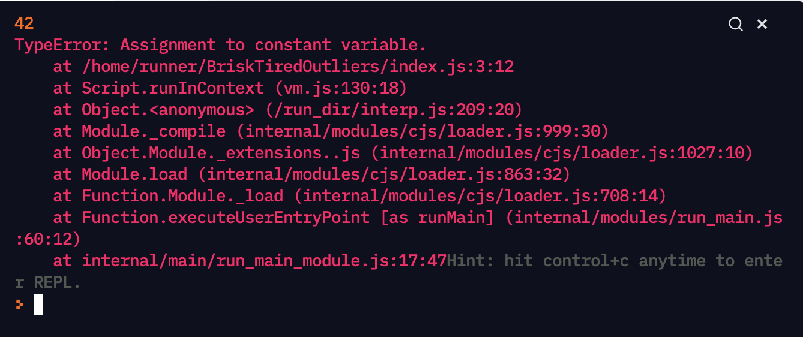

# Maniez les variables

La semaine dernière, vous avez vu les bases théoriques du développement, mais le moment est maintenant venu de nous plonger dans la pratique. 🔥 Pour cela, nous allons utiliser le langage JavaScript.

## Découvrez votre premier langage : Javascript

JavaScript, dont je vous parlerai souvent en disant "JS", est LE langage du web. Il est le seul langage de programmation à être exécuté directement depuis dans le navigateur. Je vous fais une petite démonstration juste en dessous c.


Pour vous donner quelques avantages à utiliser JS :
- Il est considéré comme un langage haut niveau, donc plus proche de l'humain.
- La particularité de JavaScript est qu'il peut être aussi bien utilisé côté frontend (ce que l'utilisateur voit), que côté backend (ce qui fait tourner les datas et tout le reste), donc cela permet de garder le même langage des deux côtés. Mais nous nous intéresserons davantage à cette question plus tard.
- la communauté autour de JS très active, ce qui permet d'avoir de nombreux outils en libre accès.

Un inconvénient assez connu de JavaScript est que le langage connaît des mises à jour tous les ans. Ce qui peut parfois le rendre difficile à suivre. Pour les développeurs pro de JS, on parle de "JS fatigue".

Si vous souhaitez en apprendre davantage sur l'histoire de JS, vous pouvez regarder [le début de cette vidéo](https://www.youtube.com/watch?v=Sh6lK57Cuk4) (attention, elle utilise des termes assez techniques).

## Appropriez-vous la syntaxe

Pour le moment, nous allons uniquement manipuler notre JS dans replit (au moins durant les 6 premières séances). Mais voyons quelques éléments de syntaxe.

### Les console.log()
Alors, il ne s'agit pas de syntaxe à proprement parler, mais une méthode qui permet d'afficher des éléments. Nous l'avons déjà utilisé.

Cette méthode est particulièrement utile, et est employée par tous les développeurs et développeuses JS.

### Les commmentaires

Tous les langages permettent d'écrire des commentaires. Il s'agit d'une syntaxe qui permet de signaler dans notre code qu'il s'agit uniquement de commentaires, et qu'ils ne doivent donc pas être interprétés par la machine, uniquement lus par les humains.

Les commentaires sont très utiles pour faciliter la relecture du code.

En JavaScript, ils se caractérisent par un double slash : `//`.

VOus pouvez les placer avant une ligne de code, ou à la fin

```
// Mon commentaire 1
console.log(42) // Mon commentaire 2
```

## Appréhendez les variables

Jusqu'à maintenant, nous avons utilisé des valeurs directement dans nos console.log, qui n'étaient donc utilisées qu'une seule fois. 

Mais comment faire si vous souhaitez faire une opération complexe ? Et réutiliser le résultat ?!

Les variables sont faites pour ça !

Elles nous permettent de mémoriser simplement des valeurs, et de pouvoir les utiliser dès que nécessaire. Chaque variable est nommée. 

On peut alors voir notre programme comme une sorte de grand meuble, dans lequel il y a des tiroirs. Les tiroirs vont permettre de stocker nos affaires (nos variables). Les tiroirs ont des sortes d'étiquettes, les noms de nos variables. Pour affecter une donnée à une variable, on utilise le signe `=` ainsi que le mot clé de variable `let`.

Nous allons ici créer la variable `maVariable`, dans laquelle on exécute l'opération "6 * 7" ce qui nous donne :
```
const maVariable = 6 * 7
```

On fait un console.log... Et on a bien le résultat ! 🎉


Essayez avec une addition, une soustraction, une multiplication et une division !

## Assignez des valeurs vos variables avec const et let

### Le cas de `const`
Mais une fois la variable déclarée, est-il possible de changer la valeur qui lui est affectée ?

Essayez pour voir.
On fait :
```
const maVariable = 6 * 7
maVariable = 10
console.log(maVariable)
```

...Et on a une erreur !


C'est normal, `const` ne permet pas de changer la valeur assignée à la variable `maVariable`.
Ce type de variable a été créé pour avoir une rigueur dans le code, où on ne peut pas changer la valeur assignée. Si on a besoin d'assigner une nouvelle valeur, on peut tout simplement déclarer une nouvelle variable :
```
const maVariable = 6 * 7
const maNouvelleVariable = 10
console.log(maVariable, maNouvelleVariable)
```

Et voilà ! 🎉

### Changez vos valeurs assignées avec `let`
Si vous avez vraiment besoin de changer de valeur, vous pouvez aussi utiliser `let`, qui permet de changer de valeur assignée. 

Typiquement :
```
let ceciEstUnTest = 0
ceciEstUnTest = 25
// Affichera bien 25 ici
console.log(ceciEstUnTest)
```

Pour vous donner un exemple où une variable est utile : lorsqu'on souhaite incrémenter notre valeur (l'augmenter régulièrement). Voici un exemple 👇
```
let compteur = 1
compteur = compteur + 1
compteur = compteur + 1
compteur = compteur + 1
console.log(compteur)
```


### N'utilisez pas `var`

Dans les anciennes versions de JavaScript, `let` et `const` n'existaient pas. À la place, on avait `var` dont le comportement était un peu différent. Ces différences rentrent un peu plus dans la technique, dont vous n'aurez pas besoin pour le moment. Gardez juste à l'esprit qu'il vaut mieux utiliser `var`. Donc si vous le voyez dans un morceau de code que vous trouvez en ligne, essayez de le remplacer par `let` ou `const`.


## Manipulez les number et string

### Les numbers

Commençons par les numbers. Vous vous en êtes déjà servi sans vous en rendre compte : les number. Pour les utiliser, pas besoin de syntaxe particulière. Vous utilisez simplement des chiffres. 

```
const maVariable = 7
```

Vous pouvez également utiliser des nombres décimaux. Pour cela, vous devez utiliser le point et non la virgule comme ci-dessous 👇
```
console.log(2.5 - 1)
// Le résultat sera 1.5
```

D'ailleurs, si vous faites 
```
console.log(1/3)
```
Vous aurez bien `0.3333333333333333`.
De la même manière, vous pouvez utiliser des nombres négatifs en JS avec un simple `-`.

```
console.log(2.5 - 42)
// Le résultat sera -39.5
```

### Les strings

Passons maintenant aux chaînes de caractères, les strings. 
Elles sont très utiles pour manipuler du texte. 

Il existe 3 différentes manières de représenter une string : avec les single quote `'`, les double quotes `"` et les backticks ` (l'accent grave).
```
console.log("Hello")
console.log('Hello')
console.log(`Hello`)
```

Même si vous ne mettez rien entre les guillemets, il s'agit tout de même d'une string.

### Faites des concaténations

Il est possible de concaténer deux strings (c'est-à-dire les relier) assez facilement en utilisant le signe `+`. Pour cela, vous écrivez votre string, puis vous indiquez `+`, et vous mettez votre deuxième string. Ce qui nous donne :
```
const concatenateString = "J'habite à " + 'Paris'
```

### Insérez des variables dans vos strings

Je vais vous montrer une méthode pour insérer une variable dans une string. Pour cela, vous allez devoir utiliser les backticks ``. 

La syntaxe est un peu particulière, mais rassurez-vous : si vous ne vous en souvenez pas, n'hésitez pas à revenir sur le cours. Et comme pour tout, vous finirez par mémoriser au fur et à mesure que vous pratiquez.

On déclare donc une variable `school`. Et on lui assigne la valeur, "Sciences Po".
Ce qui nous donne : 
```
const school = "Sciences Po"
```

On peut maintenant créer notre string 👇
```
const school = "Sciences Po"
const myString = `Je suis étudiante à ${school}`
console.log(myString)
```

Ici on obtient bien la string `Je suis étudiante à Sciences Po`. Yay ! 🎉

## Récapitulatif des types

Pour l'instant vous avez vu deux types : les strings et les numbers. Mais il en existe d'autres. Je vous mets la syntaxe juste ici des types les plus importants en JS :
```
const number = 42
const string = "Voilà ma chaîne de caractères"
const booléen = true
const objet = {
    "maClé1": "ma Valeur1",
    "maClé2": "ma Valeur2"
}
const tableau = ["valeur1", "valeur2", "valeur3"]
```

## Pour la semaine prochaine

- [Exercice 1](https://replit.com/@scpo-fall-2021/S2-variablesexercice-1#index.js)
- [Exercice 2](https://replit.com/@scpo-fall-2021/S2-variablesexercice-2#index.js)