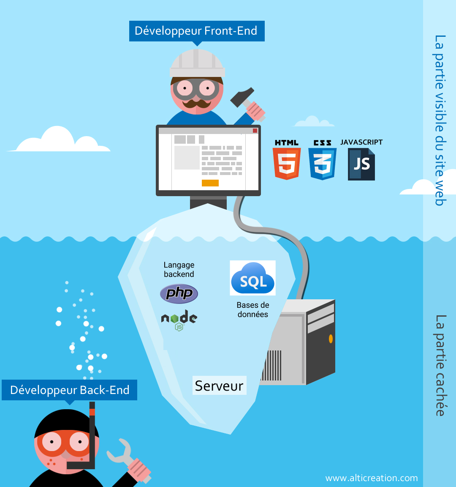
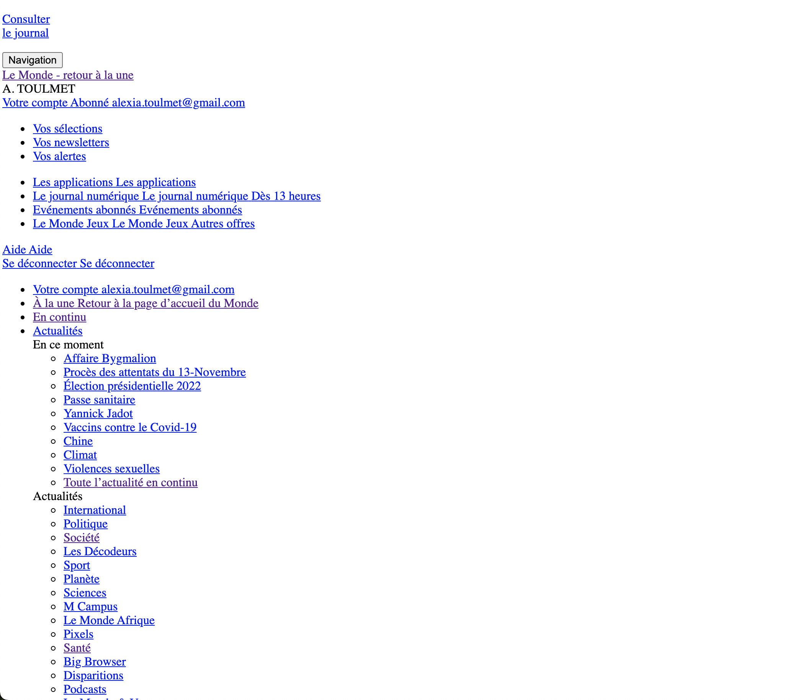
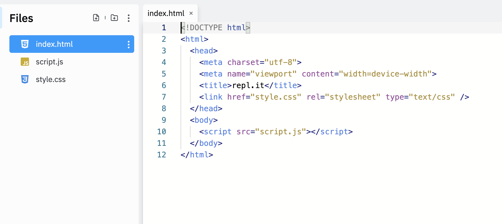
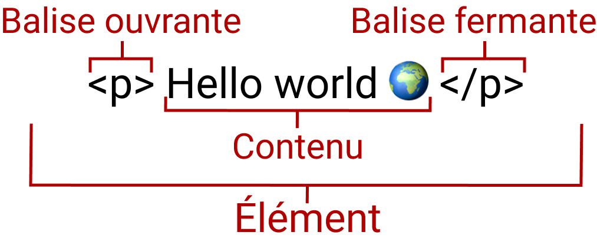
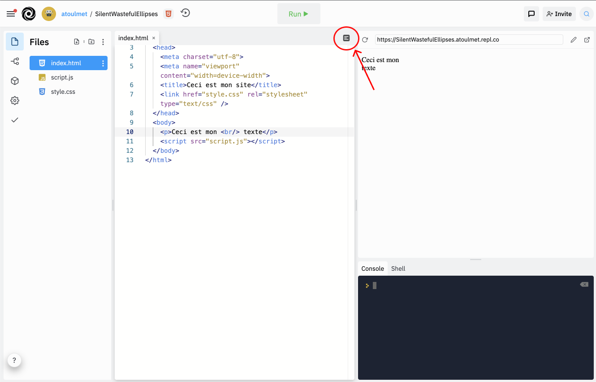

# Le web

Jusque là, nous avons utilisé JavaScript pour voir les notions fondamentales de logique du code.
Vous l'attendiez, et nous y sommes : nous allons maintenant entrer dans le ✨✨✨ monde du web. ✨✨✨

Mais avant de nous lancer dans le vif du sujet, et de coder nos premières pages web, j'aimerais revenir sur la structure du web.

> Nous avions vu quelques notions en séance d'introduction, mais quand vous tapez "www.google.com" dans la barre de votre navigateur, est-ce que vous savez ce qui se passe ?


En fait, quand vous entrez directement une url, ou que vous cliquez sur un lien, votre navigateur va chercher dans une sorte de grand annuaire des adresses internet. Il obtient alors l'adresse de là où le fichier se trouve : sur quel serveur il est. 

Le serveur va répondre à la demande de votre navigateur :
- s'il n'a pas le fichier, il va répondre 404, fichier introuvable
- Mais s'il a bien le fichier, il renvoie le fichier HTML avec le CSS et le JavaScript associé.

Yay ! 🎉

Et concrètement, qu'est-ce que ça veut dire pour les développeuses et développeurs ? Comment iels se découpent le travail ?

## Le monde des développeur·se·s

Vous avez déjà entendu parler de séparation frontend et backend. Il s'agit en fait de la séparation entre la partie visible, l'interface, qui est en frontend et la partie invisible à l'utilisateur, le backend, et la gestion des serveurs.

Dans les faits, les développeur·se·s savent souvent toucher aux deux, mais il est plus simple de se séparer le travail en entreprise.

Le frontend va donc s'occuper de créer les interactions avec l'utilisateur, de récupérer les données depuis le backend, et d'envoyer ce qui est entré par les utilisateurs. 

Iels utilisent ensuite un protocole pour basculer les infos entre le frontend et le backend. Et le backend va ensuite récupérer ses infos, les stocker dans les bases de données, faciliter l'envoi de ces infos. Puis vient la partie déploiement qui consiste à mettre tout cela en ligne sur des serveurs, qui sont comme de gros ordinateurs qui n'ont comme fonction que de mettre des fichier à disposition et les relier à internet.



Par exemple, quand vous créez un compte utilisateur, vous allez créer le champs login et password dans le frontend, vous récupérez les informations, et vous les envoyez au backend. Là le backend va vérifier que l'utilisateur n'existe pas déjà, puis crypter le mot de passe, et le stocker dans la base de données. Le frontend affiche en fonction s'il y a une erreur ou si le compte a bien été créé.

> Ça vous semble un peu plus clair ? 

Pour la suite de ce cours, nous allons nous concentrer sur la partie frontend, même si vous avez déjà manipulé node.js.

Et le HTML dans tout ça ?

## Découvrez le squelette du web : le HTML

Comme  je le disais, le HTML correspond vraiment au squelette d'un site internet, à sa structure. À la base, les lettre H, T, M et L correspondent à « HyperText Markup Language ». Le HTML est utilisé en complément avec le CSS et le JavaScript sur un site internet : 
- le HTML permet de définir la structure
- le CSS correspond au style
- et JavaScript permet de créer des interactions

Le HTML va nous permettre de créer des éléments.
Par exemple, le contenu de votre page pourra être structuré en un ensemble de paragraphes, une liste à puces avec des images et des tableaux.

Vous pouvez tout à fait créer un site internet sans aucun CSS ou JavaScript, mais ce site apparaîtra très brut.

> Démo de la page d'accueil du Monde sans CSS



Tous les sites internet sont constitués d'une page HTML. Pour le voir, il vous suffit d'utiliser l'inspecteur de vos outils de développement. 

Pour y accéder facilement, utilisez Chrome ou Safari, faites un clic droit sur n'importe quelle page, et "Inspecter". Vous avez accès au HTML de la page. Vous pouvez même le modifier.

> Essayez pour voir de modifier le titre d'un article sur Le Monde.


Si ça peut paraître amusant comme ça, les outils de développement sont indispensables en développement web pour voir ce qui apparaît vraiment sur le site, et ce qui n'apparaît pas.

## Écrivez vos premiers éléments HTML

> Créez votre première page HTML sur Replit

Vous pouvez créer un nouveau Repl, en choisissant HTML, CSS, JS. Voilà ce que vous obtenez 👇



Comme vous pouvez le voir, il y a ici ce qu'on appelle des balises, avec une balise ouvrante, et une balise fermante. Par exemple, `<title>repl.it</title>`. Ici, cela correspond au titre de la page quand vous l'ouvrez dans un onglet spécifique : essayez de le modifier pour voir et d'ouvrir votre site dans une nouvelle page.



> Attention, ici il ne faut pas mettre d'espace entre les `<>`, ni pour `</>` et le type de votre balise.

On essaie maintenant de créer un nouvel élément dans body. On fait `<h1>Bonjour Sciences Po</h1>`.
La balise ouvrante est `<h1>`, la balise fermante est le même mais avec un / en plus donc `</h1>` et on a le contenu qui va apparaître à l'intérieur.

Et voilà, vous venez d'écrire votre premier élément en HTML 🎉 !

### Comprenez les éléments qui n'apparaissent pas

Mais d'ailleurs, si on se penche sur notre page, on voit qu'il y a plein de balises qui ont été automatiquement créées par Replit mais dont le contenu n'apparaît pas sur notre page. 
- On a vu `title`, mais qu'en est-il des autres ?
- `<!DOCTYPE html>` est nécessaire au bon fonctionnement de la page
- l'élément `<html>` encadre tout le contenu de la page. On parle d'élément racine.
- `<head></head>` est le container pour toutes les choses qui font partie de la page HTML mais qui ne sont pas du contenu affiché. Le SEO ça vous dit quelque chose ? C'est le référencement de notre page par Google. Et bien pour améliorer notre SEO, il faut mettre des mots clés sur une page, une description de la page qui apparaîtra sur les moteurs de recherche, les liens vers les fichiers CSS à utiliser pour la mise en forme, et bien tout ça apparaîtra dans la balise `head`. On y met aussi les déclarations fonts qu'on utilisera, etc. 
  - Ces éléments apparaissent eux-mêmes dans des balises `meta` comme vous pouvez le voir sur replit : `<meta charset="utf-8">` nous permet de préciser la langue qui sera utilisée.
- `<body></body>` ; il contient tout le contenu que vous souhaitez afficher pour qu'il soit vu par les visiteurs :  du texte, des images, des vidéos, etc.


D'ailleurs, il y a deux éléments dont je ne vous ai pas encore parlé : 
```
<link href="style.css" rel="stylesheet" type="text/css" />
``` 
dans `head` et 
```
    <script src="script.js"></script>
```
dans `body`.

Il s'agit des liens qui permettent d'utiliser les deux fichiers CSS et JS qui ont été créés par replit. Mais nous nous en occuperons les prochaines séances. Pour l'instant, essayez de ne pas y toucher.

## Créez votre page

### Le tableau des éléments

Je vous mets ici la liste de tous les éléments que vous pourrez consulter quand vous voudrez créer vos éléments 👇: 
- les headings : on a commencé par utiliser une balise `h1` mais il existe plusieurs niveaux de titre, selon le niveau d'importance du titre à mettre en avant avec `h2`, `h3`, `h4`, `h5` et `h6`.
- les paragraphes : ils sont délimités par la balise `p`
- les div : il s'agit de la balise la plus utilisée pour créer un container d'autres éléments
- les liens avec `a` pour `anchor` : on leur passe le lien vers lequel il faut aller, on met nos éléments à l'intérieur, et quand l'utilisateur clique dessus, il est redirigé
- les images : logiquement, ces balises permettent d'afficher des images

> Démo de création des `<h2></h2>`, `<p></p>`, `<div></div>`


### Les différents types d'éléments

Les éléments HTML peuvent soit être :
- des containers pour d'autres éléments. C'est-à-dire qu'il y aura une balise ouvrante et une balise fermante, et qu'on mettra le contenu à l'intérieur.
- des éléments qui sont *self-closing* : on les utilisera après, mais les images sont dans ce cas là.

### Les attributs
On n'a pas encore vu comment créer des images et des liens. C'est normal pour cela, nous avons besoin de voir comment passer des attributs à nos éléments html : pour les liens, cela permet de passer le lien vers lequel on redirige nos utilisateurs, et pour les images, on passe la source `src`.

On aura alors `<a href="lien-vers-mon-site">Mon lien</a>`
On place l'attribut dans la balise ouvrante avant `>`. On déclare le type d'attribut directement, comme dans les objets avec l'idée de clé / valeur. Ici l'attribut est notre clé `href`, et la valeur est `lien-vers-mon-site`. Le contenu de votre attribut doit être écrit entre guillemets.

Et pour `img`, cela donne ``. Comme vous le voyez, la balise `img` est auto-fermante.

> Profitons-en pour créer des éléments dans notre page Replit : titre, texte, div, image depuis internet, image importée directement, nouvelle page replit avec lien

## D'autres éléments

- Démo du saut de ligne avec `<br />`
- Liste avec `<ol>` et `<li>`

Aller voir autres éléments dans la documentation. 

## Comment imbriquer des éléments les uns dans les autres
d
D'ailleurs, comment faire si vous voulez imbriquer des éléments les uns dans les autres ? 

Attention à toujours bien wrapper, refermer vos balises. L'élément qui a été ouvert en premier doit être refermé en dernier. 
Pour voir où vous en êtes, vous pouvez vous assurer de bien indenter votre code, notamment avec l'outil de formattage automatique sur replit.


## Jusqu'à la fin du semestre

Dans ce cours, nous allons coder votre portfolio. Sur plusieurs pages et au fil des notions maîtrisées, vous allez venir enrichir votre site avec de nouvelle fonctionnalités.
- Séance 7 : Vous allez construire la structure des deux premières pages
- Séance 8 : Vous découvrirez Figma, et vous implémenterez le style sur votre portfolio
- Séance 9 : Ce sera la découverte de JavaScript dans votre site internet
- Séance 10 : Nous nous lancerons dans les datas, et vous ferez votre première incursion dans le monde des APIs
- Séance 11 : Vous irez encore plus loin dans le monde des APIs.

Modalités de validation :

Votre site devra comporter toutes les fonctionnalités développées en cours. Vous devrez ensuite aller plus loin sur AU MOINS UN des aspects suivants :
  - Développer un nouvel univers visuel sur Figma
  - Créer une nouvelle feature sur Figma que vous implémentez en HTML, CSS, JS
  - Créer des utilisations supplémentaires de JavaScript
  - Créer une intégration de Integromat

Vous pouvez travailler seule·e ou à deux, mais les attentes seront supérieures si vous décidez de travailler en binôme.


## Pour aller plus loin :
- Si vous voulez continuer à vous faire la main sur le HTML, [vous pouvez regarder la vidéo de freeCodeCamp sur le HTML](https://www.youtube.com/watch?time_continue=1547&v=916GWv2Qs08&feature=emb_logo) qui est totalement à jour.
- Il y a également [le cours OpenClassrooms HTML et CSS](https://openclassrooms.com/fr/courses/1603881-apprenez-a-creer-votre-site-web-avec-html5-et-css3/1604192-decouvrez-le-fonctionnement-des-sites-web), mais qui commence à dater un peu plus.