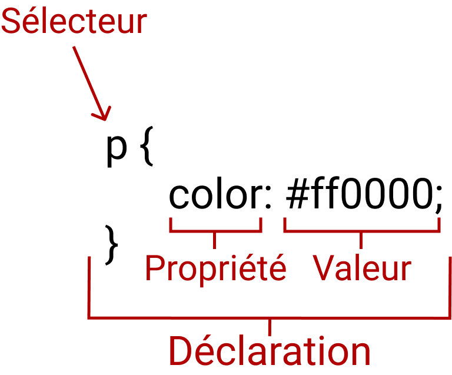

# Le style

La semaine dernière, nous nous sommes lancés dans le monde du web, en commençant par le HTML. Nos pages avaient gardé un aspect brut, sans style. Nous allons maintenant nous plonger dans le style du web 💅.

## Les maquettes

> Quand on se lance dans l'élaboration d'un site internet, ou d'une nouvelle fonctionnalité, à votre avis, quelles sont les étapes que l'on suit avant de se mettre au code ?

- On interroge les utilisateurs / clients
- On définit les besoins
- On formalise les besoins sous forme de wireframes (maquettes en fil de fer en version basse fidélité)
- On refait des retours
- On formalise les besoins sous forme de maquette
- ... ON CODE

Vous voyez, ça intervient quand même plutôt tard dans l'élaboration d'un site.

Mais d'ailleurs, c'est quoi une maquette ?

Une maquette va être une représentation haute fidélité qui reste statique (il ne se passe rien quand on clique dessus) de ce à quoi va ressembler notre site internet.
Pour créer les maquettes, on va utiliser des logiciels spécifiques.

> Est-ce que vous connaissez des logiciels qui permettent de créer des maquettes ?

Il en existe plusieurs, mais dans le cadre de ce cours, nos maquettes ont été créées et partagées sur [Figma](https://www.figma.com/files/recent?fuid=657713734792191647).

Allons d'ailleurs dès maintenant, voir [ce qui vous attend pour la suite du semestre](https://www.figma.com/file/UV2Dy0bBXinXvQhNNccuRv/Maquette-Projet-ScPo?node-id=0%3A1).

### Démo Figma

- Outil souris
- Outil frame
- Outil formes
- Outil texte
- Hiérarchie des fichiers
- Manipuler un élément dans la colonne de droite

> Pour vous faire la main, vous pouvez créer un compte, copier le projet, et vous l'approprier avec vos données / photos


### Bonus (si on a le temps)

Comment créer un univers visuel ?

1- Cherchez de l’inspiration (Dribbble, Awwwards, Pinterest)
2- Choisissez les couleurs (Coolors) avec émotions et pour prioriser l'information
3- Choisissez vos polices d’écriture (typewolf)

Si vous voulez en apprendre davantage sur le monde des maquettes et sur le design, je vous propose de lire le cours OpenClassrooms "" et vous pouvez me poser vos questions par mail.

Maintenant comment intégrer ce qui a été décidé au niveau de la maquette ? Avec le CSS !


## Découvrez le CSS

Les CSS (Cascading Style Sheets en anglais, ou « feuilles de style en cascade ») sont le code utilisé pour mettre en forme une page web. Le but du CSS est de permettre de sélectionner des éléments et de dire quel style appliquer.

### La syntaxe


Cette structure s'appelle une règle. Les différentes parties se nomment :

- Sélecteur : C'est le nom de l'élément HTML situé au début de l'ensemble de règles. Il permet de sélectionner les éléments sur lesquels appliquer le style souhaité, dans notre cas, les éléments *p*. Pour mettre en forme un élément différent, il suffit de changer le sélecteur.

- Déclaration : C'est une règle simple comme `color: red;` qui détermine les propriétés de l'élément que l'on veut mettre en forme.

- Propriétés : Les différentes façons dont on peut mettre en forme un élément HTML (dans ce cas, color est une propriété des éléments p). En CSS, vous choisissez les différentes propriétés que vous voulez utiliser dans une règle CSS.

- Valeur de la propriété : À droite de la propriété, après les deux points, on a la valeur de la propriété. Celle-ci permet de choisir une mise en forme parmi d'autres pour une propriété donnée (par exemple, il y a d'autres couleurs que red pour la propriété color).


Quelques précisions sur la syntaxe :

- chaque ensemble de règles, à l'exception du sélecteur, doit être entre accolades ({}).
- pour chaque déclaration, il faut utiliser deux points (:) pour séparer la propriété de ses valeurs.
- pour chaque ensemble de règles, il faut utiliser un point-virgule (;) pour séparer les déclarations entre elles.

Ainsi, si on veut modifier plusieurs propriétés d'un coup, on peut utiliser plusieurs déclarations dans une seule règle en les séparant par des points-virgules :

```
p {
  color: red;
  width: 500px;
  border: 1px solid black;
}
```

### Les sélecteurs

Jusque là, nous avons sélectionné les éléments en utilisant leur type (*p*). Mais il existe des moyens de nous même déclarer des sélecteurs qui permettront de faire nos déclarations en CSS.

Voici un tableau qui reprend les principaux types de sélecteurs 👇

Nom du sélecteur | Ce qu'il sélectionne	| Exemple
:-: | :-: |:- 
Sélecteur d'élément (parfois appelé « sélecteur de balise » ou « sélecteur de type ») | Tous les éléments HTML d'un type donné.	p | sélectionne tous les `<p>`
Sélecteur d'ID | L'élément d'une page qui possède l'ID fourni (pour une page HTML donné, on ne peut avoir qu'un seul élément pour un ID donné) #my-id | sélectionne `<p id="my-id"> ou <a id="my-id">`
Sélecteur de classe | Les éléments d'une page qui sont de la classe donnée (pour une page donnée, il est possible d'avoir plusieurs éléments qui partagent une même classe). .my-class | sélectionne `<p class="my-class"> et <a class="my-class!">`

### Concentrons nous sur les classes

Dans le html, on écrit donc `class="nom-de-classe"`, et dans le css, cela donne 
```
.nom-de-classe {
  color: red;
}
``` 

### Manipuler le CSS dans l'inspecteur

Tout comme pour le HTML, il est possible de manipuler le CSS sur n'importe quelle page. Par exemple, on peut décider de modifier l'identité graphique du site de l'Elysée.

### Mise en forme de la page

Propriétés utilisées :
- font, font-size, font-family, font-weight
- text-align
- color, background-color
- margin, padding, height, width
- margin auto pour aligner
- border, border-radius
- position (relative, absolute)

## Pour la semaine prochaine 

Implémenter [la maquette Figma](https://www.figma.com/file/nhZlQO3cqijSd1QomhW6zZ/Maquette-Projet-ScPo-S7-%2B-S8?node-id=0%3A1)

## Pour aller plus loin :
- Pour avoir davantage de manière d'appliquer du style, n'hésitez pas à aller voir [la documentation en ligne MDN sur le CSS](https://developer.mozilla.org/fr/docs/Web/CSS).
- Il y a [le cours OpenClassrooms HTML et CSS](https://openclassrooms.com/fr/courses/1603881-apprenez-a-creer-votre-site-web-avec-html5-et-css3/1604192-decouvrez-le-fonctionnement-des-sites-web), mais qui commence à dater un peu plus.
- Mais encore plus qualitatif, vous trouverez [le cours complet de freeCodeCamp CSS Full Course](https://www.youtube.com/watch?v=ieTHC78giGQ).
