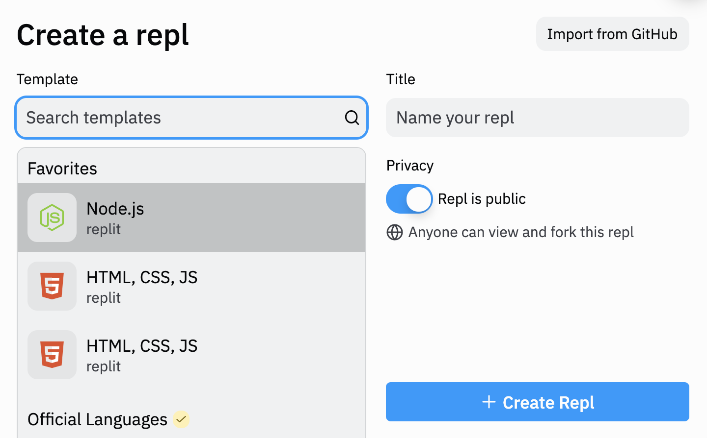
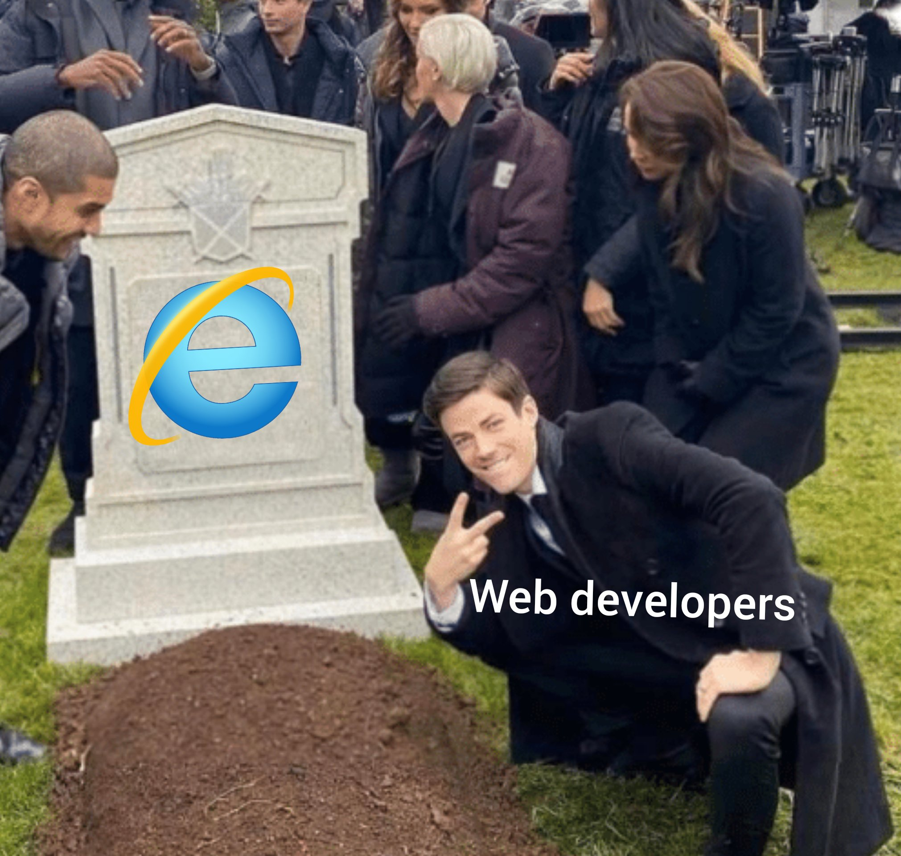
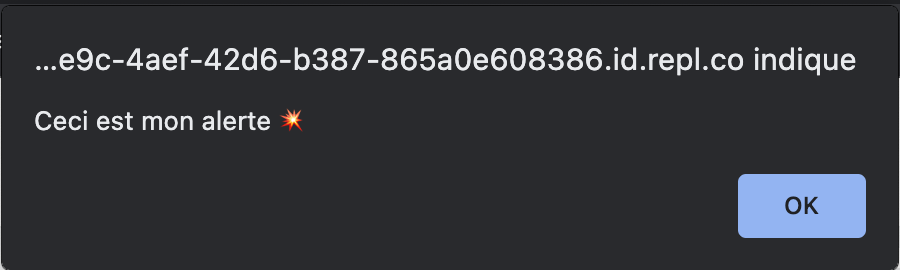
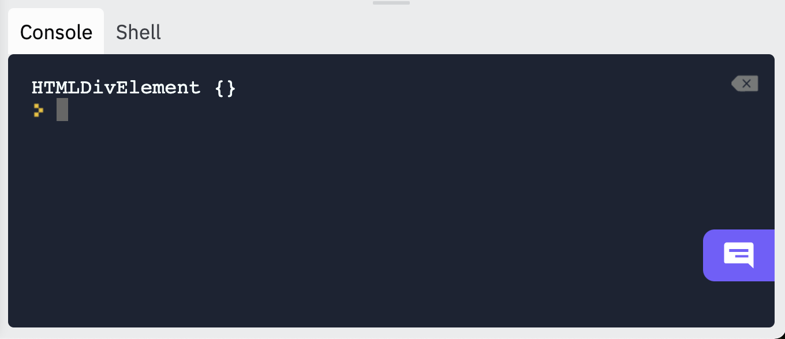

# Découvrez la facette frontend de Javascript

Maintenant que nous avons la structure et le style, voilà venu le moment d'ajouter des interactions à notre site internet ! 🎉 Pour cela, nous allons utiliser le même langage que vous utilisez depuis le début du semestre : le JavaScript... Mais côté navigateur.

## Comprenez les différentes utilisations de JS 
Est-ce que vous vous souvenez ? Jusqu'à maintenant, quand deviez créer un nouveau projet sur Replit en JavaScript, je vous faisais choisir `node.js` ?


En fait, cela correspond à une utilisation backend de JavaScript, nous permettant alors de faire nos exercices de logique du code, sans avoir à gérer une interface mais en manipulant directement le code et en affichant le rendu de nos exercices dans la console. Le JavaScript peut être exécuté côté serveur depuis la création de `node.js` en 2009.

> Plutôt récent n'est-ce pas ?

Ainsi, les développeurs pouvaient développer une application de bout en bout en JavaScript, sans avoir à changer de langage entre le frontend et le backend. Typiquement, un développeur n'aura pas à changer de syntaxe lorsqu'il utilise des variables, des conditions, boucles, fonctions, etc. dans son code. Plutôt pratique 🤩.

Mais historiquement, JavaScript a été développé pour être exécuté côté frontend. 

### L'invention de JavaScript

Le langage a vu le jour en 1995 afin de manipuler les éléments HTML, et donc de créer des intéractions. 

À l'époque, il avait été créé pour un des leader du marché des navigateurs : Netscape. L'idée était simple :  proposer des interactions aux utilisateurs, sans avoir à recharger toute la page. Il fallait pouvoir exécuter du code directement sur l'ordinateur de l'utilisateur qui serait récupéré pendant la requête au serveur. Un talentueux développeur a donc été recruté chez Netscape, et a pu créer les bases de JavaScript ... en 10 jours.

Puis Microsoft, sentant que l'enjeu de l'interaction était de taille, développe également son propre langage pour créer des interactions sur les pages internet. JScript voit le jour dans Internet Explorer en 1996.

Netscape soumet alors JavaScript à l'ECMA (European association for standardizing information and communication systems) pour que le langage soit standardisé. Les travaux débutent en novembre 1996, et se terminent en juin 1997 par l'adoption du nouveau standard ECMAScript. 

> Si l'histoire de JavaScript vous intéresse, je vous conseille [cette excellente vidéo](https://www.youtube.com/watch?v=Sh6lK57Cuk4).
> Vous pouvez également regarder la série Halt and Catch Fire qui se passe entre les années 80 et 90, et qui abordent différents thèmes de l'histoire d'internet.

Encore de nos jours, l'association se réunit régulièrement et décide des nouvelles fonctionnalités et nouveaux standards à inclure dans le langage. Encore aujourd'hui, il y a certaines notations / fonctions / etc. qui fonctionnent dans un navigateur et pas dans un autre. Même si des règles communes sont définies, les implémentations restent différentes. C'était tout particulièrement le cas pour Internet Explorer. Quand on doit coder des fonctionnalités complexes en frontend, assurer la compatibilité pouvait parfois relever du défi. C'est pourquoi la plupart des développeurs web ont accueilli la fin d'Internet Explorer avec soulagement.



Depuis, l'importance de JavaScript ne cesse de grandir. Essayez de désactiver JavaScript dans vos devtools pour voir ce que cela donne ?
> paramètres > confidentialité et sécurité > paramètre des sites > javascript

## Éxécutez du JavaScript dans le navigateur

### Déclarez du code JavaScript dans votre HTML
Mais concrètement comment cela fonctionne ?
Quand vous avez créé un projet HTML, CSS, JS dans Replit, vous vous souvenez qu'un fichier `script.js` est importé par défaut avec `<script src="script.js"></script>`. Ici, HTML déclare une balise script. Avec l'attribut `src`, il importe le contenu du fichier `script.js`. Mais vous auriez complètement pu écrire directement votre HTML directement dans la balise `script`. 

Testez pour voir en faisant 👇:
```
<script>
    console.log("Hello")
</script>
```

Maintenant que nous utilisons JavaScript dans le navigateur, je vais vous montrer une autre fonction native en JavaScript qui vous permet d'afficher quelque chose de manière encore plus visible : `alert`. 

Utilisez pour voir 👇: 
```
    <script>
      alert("Hello")
    </script>
```

Maintenant que vous avez vu comment cela fonctionne, vous pouvez écrire votre code JS dans le fichier `script.js`.


## Écoutez des événements

C'est bien beau, on exécute du JS au chargement de notre page, mais ce n'est pas très pratique : nous ce qu'on veut c'est créer des interactions en fonction des actions de l'utilisateur. Comment faire pour déclencher notre alerte quand on clique sur un bouton ?

Pour cela, il va nous falloir utiliser les attributs d'événements dans le HTML et lier ça avec des fonctions JavaScript. En somme utiliser des attributs HTML et des fonctions JS, rien que vous ne sachiez déjà faire ?!

On commence par créer une fonction dans notre JavaScript :
```
function creerAlerte() {
    alert("Ceci est mon alerte 💥")
}
```

si vous exécutez votre code, rien ne se passe : c'est normal, la fonction n'est pas appelée. 

Vous pouvez l'appeler juste en dessous directement dans le JS : 
```
function creerAlerte() {
    alert("Ceci est mon alerte 💥")
}

creerAlerte()
```

Quand vous runnez votre code, la fonction s'exécute bien. 

Maintenant, pour la lier à votre bouton, vous allez devoir la passer en attribut.

Commencez par créer un bouton :
`<button>Cliquez ici</button>`

Pour l'instant, quand vous cliquez dessus rien ne se passe. 
Il faut lui passer un attribut d'événement `onclick` dans lequel vous lui passez la fonction à exécuter :
```
<button onclick="creerAlerte()">Cliquez ici</button>
```

Essayez pour voir ?

Et voilà, votre alerte s'affiche bien comme souhaité ! 

## Modifiez votre HTML avec JavaScript

Vous avez créé votre première interaction : félicitations à vous ! 🎉 Mais une fois que vous fermez votre fenêtre d'alerte, rien ne reste. Comment faire pour modifier le contenu de votre page HTML avec JavaScript ?

Pour cela JavaScript va vous permettre d'accéder à n'importe quel élément et de changer son contenu.

### Accédez à un élément

Quand vous avez écrit votre HTML, et que vous l'ouvrez avec votre navigateur, vous voyez qu'il a généré tous vos éléments. Il s'agit du DOM, le *Document Object Model*.

Et bien, JavaScript met à notre disposition tout un ensemble de fonctions qui permettent de parcourir le contenu de votre DOM. La fonction la plus connue est `getElementById`. Son principe est simple : on passe une sorte de marqueur à un élément HTML qui sera dans notre DOM en lui donnant un attribut `id` (sur le m6eme modèle des attributs `class` qu'on avait utilisés la semaine dernière), ce qui nous permet ensuite de le récupérer dans le JavaScript en utilisant cet `id`.

Testons tout de suite !
Dans notre HTML, on déclare une `div` vide avec un `id` "ceci-est-mon-element" 👇 :
```
<div id="ceci-est-mon-element"></div>
```

On met ensuite dans notre JS 👇 :
```
const monElement = document.getElementById("ceci-est-mon-element")
```

Testons un `console.log` de `monElement` pour voir :


On voit qu'on a bien récupéré notre élément du DOM. Maintenant, il ne nous reste plus qu'à mettre du contenu avec HTML. 

On peut maintenant mettre du texte à l'intérieur en faisant :
```
monElement.textContent = "Coucou 👋"
```

Si vous runnez, `Coucou 👋` s'affiche bien sur la page !

> Attention, un même `id` ne peut être utilisé qu'une seule fois dans le DOM
 
### Créez des interactions

Pour l'instant, l'intérêt est limité puisque nous avons effectué notre modification de la page avec JS directement au chargement de la page. Nous allons donc rendre tout cela plus sophistiqué en intégrant ce que nous avions vu juste avant avec les événements.

L'idée ici va être de faire apparaître le texte `Coucou 👋` au clic sur un bouton.

On crée donc notre bouton dans le HTML qui appelle la fonction afficherTexte quand on clique dessus :
```
<button onclick="afficherTexte()">Cliquer</button>
```

et dans le JS, on vient créer la fonction `afficherTexte` :
```
function afficherTexte() {
  const monElement = document.getElementById("ceci-est-mon-element")

  monElement.textContent = "Coucou 👋"

}
```

Et voilà, vous avez votre première véritable interaction JS ! 🎉

Vous pouvez en profiter pour utiliser les conditions :
```
function afficherTexte() {
  const monElement = document.getElementById("ceci-est-mon-element")

  if (monElement.textContent === "") {
  monElement.textContent = "Coucou 👋"
  }
  else {
    monElement.textContent = ""
  }

}
```

Pas mal, n'est-ce pas ? 🤩

Sachez qu'il existe des fonctions pour créer tous les éléments d'un site en JavaScript. Ici, nous avons juste modifié le contenu texte d'éléments déjà existants, mais vous pouvez tout à fait créer de nouveaux éléments de zéro. Par exemple, pour créer une image dans votre `div`, vous auriez pu faire :
```
    const img = document.createElement( 'img' );
    img.setAttribute("src", '/image.png')
    div.appendChild(img)
```

> Je vous propose de cacher / afficher le contenu de la catégorie "Associatif" au clic sur le titre en mettant une petite icône pour plier / déplier.

> Vous pouvez faire la même chose pour les langues parlées

> Nous allons également créer un filtre pour afficher seulement un type de contenu